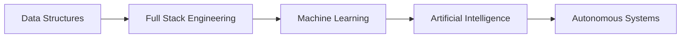

<!-- ================================================= -->
<!--              ARPITA_AI SYSTEM CORE               -->
<!-- ================================================= -->

```bash
> Initializing ARPITA_AI v3.0
> Loading neural architecture...
> Connecting to GitHub mainframe...
> Status: ONLINE
```

# 🧠 ARPITA GUPTA // AI SYSTEM ARCHITECT

```yaml
identity:
  role: Intelligent Systems Developer
  specialization: Full Stack Engineering + Machine Learning
  objective: Build scalable intelligent systems
  evolution_status: Active
```

---

## 🧬 CORE NEURAL MODULES

```python
class ArpitaAI:

    def __init__(self):
        self.languages = ["Python", "Java", "C++", "JavaScript", "TypeScript"]
        self.frontend = ["React", "Next.js"]
        self.backend = ["Node.js"]
        self.databases = ["PostgreSQL", "MongoDB", "MySQL"]
        self.ml_stack = ["NumPy", "Pandas", "Scikit-Learn", "Plotly"]

    def mission(self):
        return "Design adaptive, production-grade intelligent systems."

    def current_upgrade(self):
        return ["Machine Learning", "Artificial Intelligence", "Deep Learning"]
```

---

## ⚙ SYSTEM CAPABILITIES

```
✓ Algorithmic Problem Solving
✓ Scalable Backend Architecture
✓ REST API Engineering
✓ Data Pipelines & Processing
✓ Model Training & Evaluation
✓ Competitive Programming Mindset
```

---

## 🧪 LEARNING PIPELINE



---

## 📊 AI PERFORMANCE METRICS


---

<!-- =============================================== -->
<!--        NEURAL ACTIVITY VISUALIZATION           -->
<!-- =============================================== -->

## 🐍 Neural Activity Stream

```bash
> Rendering contribution neural pathways...
> Tracking commit frequency...
> Visualizing activity matrix...
```


```bash
> Status: Continuous Evolution Detected.
```

---

## 🛰 ACTIVE NETWORKS

```
LinkedIn   → linkedin.com/in/arpita-gupta1
Email      → arpitagupta17448@gmail.com
LeetCode   → leetcode.com/u/guptaarpita/
Codeforces → codeforces.com/profile/guptaarpita
CodeChef   → codechef.com/users/arpitagupta250
HackerRank → hackerrank.com/profile/arpitagupta2504
X          → x.com/ArpitaGupta2504
Instagram  → instagram.com/gupta_arpita_25
```

---

```bash
> SYSTEM MESSAGE:
> "The future belongs to engineers who teach machines to think."
```

<!-- ================================================= -->
<!--                 END OF TRANSMISSION               -->
<!-- ================================================= -->
